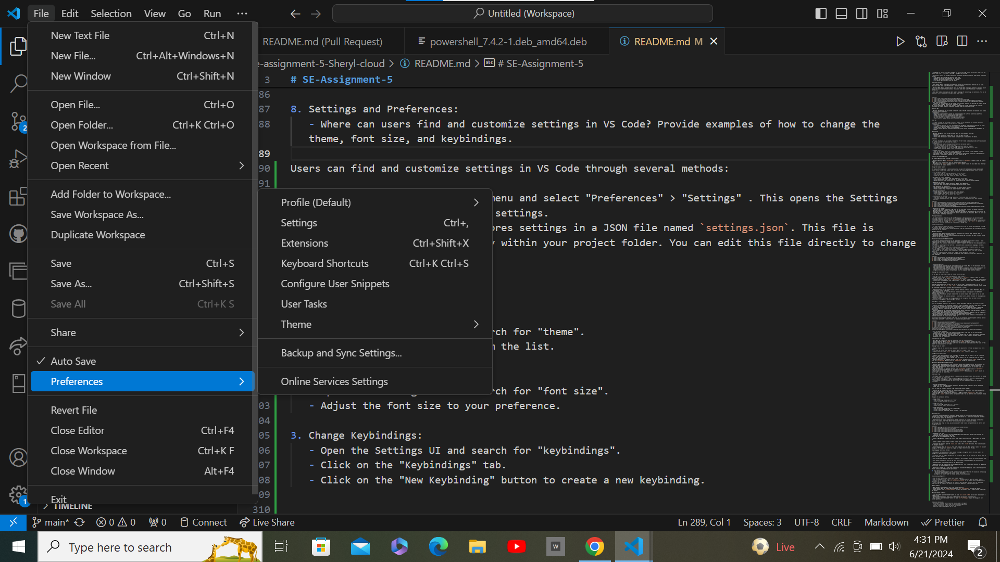

# SE-Assignment-5
Installation and Navigation of Visual Studio Code (VS Code)
 Instructions:
Answer the following questions based on your understanding of the installation and navigation of Visual Studio Code (VS Code). Provide detailed explanations and examples where appropriate.

 Questions:

1. Installation of VS Code:
   - Describe the steps to download and install Visual Studio Code on Windows 11 operating system. Include any prerequisites that might be needed.
   To download and install Visual Studio Code (VS Code) on Windows 11, follow these steps:

Step 1: Download the Installer

1. Open your web browser and navigate to the official Visual Studio Code website: [code.visualstudio.com](https://code.visualstudio.com/).
2. Click on the "Download for Windows" button to download the Visual Studio Code installer.

 Step 2: Run the Installer

1. Once the installer is downloaded, locate the downloaded file (typically in your Downloads folder).
2. Double-click on the installer file to run it.

 Step 3: Install VS Code

1. In the installer window, you may be prompted to confirm the installation. Click on "Yes" or "Run" to proceed.
2. The installer will launch the Visual Studio Code Setup wizard. Follow the on-screen instructions to proceed with the installation.
3. Review the license agreement and click on "I accept the agreement" to proceed.
4. Choose the destination folder where you want to install Visual Studio Code or leave the default location.
5. Click on the "Next" button to proceed with the installation.
6. Choose any additional tasks you want to perform, such as creating a desktop shortcut or adding VS Code to the PATH environment variable.
7. Click on the "Next" button to start the installation process.
8. Once the installation is complete, click on the "Finish" button to exit the setup wizard.

Step 4: Launch VS Code

1. After the installation is complete, you can launch Visual Studio Code by double-clicking its icon in the Start menu or by searching for "Visual Studio Code" in the Windows search bar

Citations:
[1] https://www.youtube.com/watch?v=cu_ykIfBprI
[2] https://www.c-sharpcorner.com/article/how-to-install-visual-studio-code-on-windows-11/
[3] https://www.youtube.com/watch?pp=ygUJI3Zpc3VhbHN0&v=Bn4TuMkHmB0

2. First-time Setup:
   - After installing VS Code, what initial configurations and settings should be adjusted for an optimal coding environment? Mention any important settings or extensions.

 Initial Configurations

1. Font and Theme: Adjust the font size, font family, and theme to your preference. This can be done under File > Preferences > Settings > Text Editor > and Theme.

2. Indentation and Line Length: Configure the indentation and line length to suit your coding style. This can be done under File > Preferences > Settings > Text Editor> Indentation and Line Length.

3. Code Completion and IntelliSense: Enable code completion and IntelliSense to improve coding efficiency. This can be done under File> Preferences> Settings > Text Editor > Code Completion and IntelliSense.

4. Debugging and Testing: Configure debugging and testing settings to suit your project needs. This can be done under File > Preferences > Settings > Debugging and Testing.

5. Extensions: Install and configure extensions to enhance coding functionality. Some popular extensions include:
   - Code Runner: For running code directly in VS Code.
   - Debugger for Chrome: For debugging web applications.
   - GitLens: For visualizing Git history and changes.
   - Live Server: For running a local web server.

 Important Settings

1. Auto Update: Enable or disable auto-updates to ensure you have the latest features and bug fixes. This can be done under File > Preferences > Settings > Updates.

2. Portable Mode: Enable portable mode to store all VS Code data in a single directory, making it easier to move the environment between machines. This can be done under File > Preferences > Settings > Portability.

3. User Data Folders: Configure user data folders to manage VS Code settings and extensions. This can be done under File > Preferences > Settings > User Data Folders.

Citations:
[1] https://code.visualstudio.com/docs/setup/setup-overview
[2] https://dev.to/2320sharon/creating-the-ideal-coding-environment-3hpk
[3] https://www.skillreactor.io/blog/step-by-step-guide-to-setting-up-a-development-environment/
[4] https://study.com/academy/lesson/how-to-setup-a-coding-environment-for-programming-in-java.html
3. User Interface Overview:
   - Explain the main components of the VS Code user interface. Identify and describe the purpose of the Activity Bar, Side Bar, Editor Group, and Status Bar.
The Visual Studio Code (VS Code) user interface is designed to provide an efficient and organized environment for coding. The main components of the VS Code user interface include:

 Activity Bar

1. Purpose: The Activity Bar is located on the left side of the VS Code window and provides quick access to various features and tools.
2. Components:
   - Explorer: Displays the file system and allows navigation to different directories and files.
   - Debug: Provides access to debugging tools and settings.
   - Extensions: Manages extensions installed in VS Code.
   -Run View: Displays the output of running tasks and commands.
   - Source Control: Manages version control systems like Git.

 Side Bar

1. Purpose: The Side Bar is located on the left side of the VS Code window and provides additional information and tools related to the current file or project.
2. Components:
   - File Explorer: Displays the file system and allows navigation to different directories and files.
   - Terminal: Provides a command-line interface for running commands and debugging.
   - Debug Console: Displays output from the debugger.
   - Version Control: Displays information about the version control system and allows management of changes.

Editor Group

1. Purpose: The Editor Group is the main area where you write and edit your code.
2. Components:
   - Editor: The main editor window where you write and edit your code.
   - Editor Tabs: Allow you to switch between multiple files or views within the editor.

Status Bar

1. Purpose: The Status Bar is located at the bottom of the VS Code window and provides information about the current state of the editor and the project.
2. Components:
   - Line and Column Numbers: Displays the current line and column numbers.
   - File Path: Displays the current file path.
   - File Status: Indicates the file status (e.g., modified, saved, or unsaved).
   - Language Mode: Displays the current language mode (e.g., JavaScript, HTML, or CSS).
   - Indent Guides: Displays guides to help with indentation.

4. Command Palette:
   - What is the Command Palette in VS Code, and how can it be accessed? Provide examples of common tasks that can be performed using the Command Palette.
   The Command Palette in Visual Studio Code  is a powerful feature that allows you to quickly access and execute a wide range of commands and actions within the IDE.

Accessing the Command Palette

The Command Palette can be accessed in several ways:

1. Keyboard Shortcut: Press `Ctrl+Shift+P` (Windows/Linux) or  to open the Command Palette.
2. Menu Bar: Click on the "View" menu and select "Command Palette".
3. Quick Open: Press `Ctrl+P` (Windows/Linux) to open the Quick Open menu, then type `>` to switch to the Command Palette.

 Using the Command Palette

The Command Palette provides a centralized location to search for and execute various commands and actions within VS Code. Some common tasks that can be performed using the Command Palette include:

1. File and Editor Actions:
   - Open a file: Type the file name and select it from the list.
   - Save the current file: Type "save" and select "File: Save".
   - Close the current file: Type "close" and select "File: Close".

2. Workspace and Project Management:
   - Open a folder or workspace: Type "open" and select "File: Open".
   - Switch between open files: Type "switch" and select "File: Switch to File".
   - Manage extensions: Type "extensions" and select the desired extension-related command.

3. Debugging and Testing:
   - Start debugging: Type "debug" and select "Debug: Start Debugging".
   - Run tests: Type "test" and select the desired testing-related command.

4. Code Formatting and Refactoring:
   - Format the current document: Type "format" and select "Format Document".
   - Rename a symbol: Type "rename" and select "Refactor: Rename Symbol".

5. Git and Source Control:
   - Stage changes: Type "git" and select "Git: Stage Changes".
   - Commit changes: Type "commit" and select "Git: Commit".
   - Push changes: Type "push" and select "Git: Push".

6. Customization and Settings:
   - Open user settings: Type "settings" and select "Preferences: Open User Settings".
   - Customize keyboard shortcuts: Type "keyboard" and select "Keyboard Shortcuts: Open Keyboard Shortcuts".

Citations:
[1] https://www.nobledesktop.com/learn/visual-studio-code/topic-2b-vs-code-command-palette
[2] https://docs.github.com/en/codespaces/reference/using-the-vs-code-command-palette-in-codespaces
[3] https://code.visualstudio.com/api/ux-guidelines/command-palette
[4] https://www.youtube.com/shorts/LneOFLTH40Y
[5] https://stackoverflow.com/questions/45576952/keyboard-shortcut-to-open-command-palette-in-vs-code

5. Extensions in VS Code:
   - Discuss the role of extensions in VS Code. How can users find, install, and manage extensions? Provide examples of essential extensions for web development.
   Extensions play a crucial role in Visual Studio Code (VS Code) as they enhance the functionality of the IDE and provide additional features to improve productivity and efficiency.

 Finding Extensions

1. VS Code Marketplace: The official VS Code Marketplace is the primary source for discovering and installing extensions. Users can search for extensions by name, description, or tags.
2. Extensions View: In VS Code, users can access the Extensions View by clicking on the Extensions icon in the left sidebar or pressing `Ctrl + Shift + X` (Windows/Linux). This view lists all installed extensions and allows users to manage them.

 Installing Extensions

1. VS Code Marketplace: Users can install extensions directly from the VS Code Marketplace by clicking the "Install" button next to the extension.
2. Extensions View: Users can also install extensions from the Extensions View by clicking the "Install" button next to the extension.

 Managing Extensions

1. Extensions View: Users can manage extensions by enabling or disabling them, updating them, or uninstalling them from the Extensions View.
2. Extension Settings: Users can configure extension settings by clicking on the gear icon next to the extension in the Extensions View.

 Essential Extensions for Web Development

1. Live Server: A popular extension for web development, Live Server allows users to launch a local development server with live reload features for static and dynamic pages.
2. REST Client: This extension enables users to send HTTP requests and read the return message directly in VS Code.
3. Prettier: A code formatter that enforces a consistent style across multiple languages, including HTML, CSS, and JavaScript.
4. GitLens: A powerful extension that provides a visual representation of the Git history and allows users to compare branches, commits, and files across commits.
5. GitHub Copilot: An AI-powered extension that provides code suggestions and auto-completion.
6. Auto Rename Tag: An extension that automatically renames matching tags in HTML, XML, PHP, and JavaScript.
7. CSS Peek: An extension that allows users to peek at CSS code within HTML files.
8. JavaScript Code Snippets: An extension that provides code snippets for JavaScript, TypeScript, and other languages.

Citations:
[1] https://www.syncfusion.com/blogs/post/top-vs-code-extensions
[2] https://github.com/microsoft/vscode-extension-samples
[3] https://code.visualstudio.com/api/extension-guides/overview
[4] https://x-team.com/blog/best-vscode-extensions/

   

6. Integrated Terminal:
   - Describe how to open and use the integrated terminal in VS Code. What are the advantages of using the integrated terminal compared to an external terminal?
   The integrated terminal in Visual Studio Code  is a powerful feature that allows you to run command-line tools and scripts directly within the IDE.

 Opening the Integrated Terminal

You can open the integrated terminal in VS Code in several ways:

1. Menu Bar: Go to the "Terminal" menu and select "New Terminal".
2. Command Palette: Press `Ctrl+Shift+P` (Windows/Linux) to open the Command Palette, then search for and select "Terminal: Create New Terminal".
3. **Keyboard Shortcut: Press `Ctrl+\`` (Windows/Linux)  to toggle the terminal panel.
4. Context Menu: In the Explorer view, right-click on a folder and select "Open in Integrated Terminal".

Using the Integrated Terminal

Once the integrated terminal is open, you can use it just like a standalone terminal. You can run various commands, such as `git` or any other command-line tools installed on your system.

The integrated terminal also provides additional features, such as:

- Terminal Profiles: You can switch between different terminal profiles, such as PowerShell, Bash, or zsh, depending on your preference.
- Split Terminals: You can split the terminal into multiple panes, allowing you to run different commands simultaneously.
-Terminal Tabs: You can open multiple terminal tabs and switch between them, similar to how you work with editor tabs.
- Terminal Scrollback: The terminal maintains a scrollback history, making it easier to review previous commands and output.
- Terminal Linking: The terminal can recognize and link to file paths, URLs, and other relevant information, allowing you to quickly navigate to them.

Advantages of the Integrated Terminal

1. Seamless Integration: The integrated terminal is tightly integrated with the VS Code editor, allowing you to quickly switch between coding and running commands without leaving the IDE.
2. Improved Productivity: You can perform common tasks, such as running build scripts or deploying applications, directly within the IDE, reducing the need to switch between different windows or applications.
3. Enhanced Debugging: The integrated terminal provides better integration with the debugger, making it easier to debug issues that arise during the development process.
4. Customization: You can customize the integrated terminal's appearance, behavior, and key bindings to suit your preferences, creating a more personalized development environment.
5. Workspace Awareness: The integrated terminal is aware of your current workspace, allowing you to run commands relative to the project you're working on.

Citations:
[1] https://www.youtube.com/watch?v=ewhgnBe2trY
[2] https://itnext.io/easy-enhancements-for-vs-codes-terminal-6dda2c22ee5c?gi=92aa54a54519
[3] https://code.visualstudio.com/docs/terminal/basics
[4] https://www.reddit.com/r/vscode/comments/8vdk2m/i_know_that_the_advantage_of_vscode_is_that_it/

7. File and Folder Management:
   - Explain how to create, open, and manage files and folders in VS Code. How can users navigate between different files and directories efficiently?
   VS Code provides a range of features to help users manage files and folders efficiently. Here's how to create, open, and manage files and folders in VS Code, as well as how to navigate between different files and directories:

Creating Files and Folders

1. File Menu: Go to the "File" menu and select "New File" to create a new file.
2. Keyboard Shortcut: Press `Ctrl+N` (Windows/Linux)  to create a new file.
3. Explorer View: In the Explorer view, right-click on the desired folder and select "New File" or "New Folder" to create a new file or folder.

 Opening Files and Folders

1. Explorer View: In the Explorer view, navigate to the desired file or folder and double-click it to open it.
2. File Menu: Go to the "File" menu and select "Open File" to open a file.
3. Keyboard Shortcut: Press `Ctrl+O` (Windows/Linux) or  to open a file.

 Managing Files and Folders

1. Explorer View: Use the Explorer view to navigate and manage files and folders. You can create new folders, rename files and folders, and delete them.
2. File Menu: Use the "File" menu to manage files and folders. You can create new files and folders, open files, and close files.
3. Keyboard Shortcuts: Use keyboard shortcuts like `Ctrl+S` (Windows/Linux)   to save files and `Ctrl+Shift+S` (Windows/Linux)  to save all files.

 Navigating Between Files and Directories

1. Explorer View: Use the Explorer view to navigate between files and directories. You can expand and collapse folders, and use the breadcrumb trail to navigate up and down the directory hierarchy.
2. File Menu: Use the "File" menu to navigate between files and directories. You can open files and folders from the menu.
3. Keyboard Shortcuts: Use keyboard shortcuts like `Ctrl+Shift+P` (Windows/Linux)  to open the Command Palette and search for files and directories.
4. Quick Open: Use the Quick Open feature by pressing `Ctrl+P` (Windows/Linux)  to quickly open files and directories.

8. Settings and Preferences:
   - Where can users find and customize settings in VS Code? Provide examples of how to change the theme, font size, and keybindings.

Users can find and customize settings in VS Code through several methods:

1. Settings UI: Go to the "File" menu and select "Preferences" > "Settings" . This opens the Settings UI, where you can browse and edit settings.
2. Settings JSON File: VS Code stores settings in a JSON file named `settings.json`. This file is located in the `.vscode` directory within your project folder. You can edit this file directly to change settings.

 Examples of Customizing Setting:

1. Change Theme:
   - Open the Settings UI and search for "theme".
   - Select the desired theme from the list.

2. Change Font Size:
   - Open the Settings UI and search for "font size".
   - Adjust the font size to your preference.

3. Change Keybindings:
   - Open the Settings UI and search for "keybindings".
   - Click on the "Keybindings" tab.
   - Click on the "New Keybinding" button to create a new keybinding.

Citations:
[1] https://glaforge.dev/posts/2023/03/08/some-custom-vscode-settings/
[2] https://www.youtube.com/watch?v=V0s7uQlbSRY
[3] https://code.visualstudio.com/docs/editor/custom-layout
[4] https://code.visualstudio.com/docs/introvideos/customize

9. Debugging in VS Code:
   - Outline the steps to set up and start debugging a simple program in VS Code. What are some key debugging features available in VS Code?
Setting Up and Starting Debugging in VS Code

1. Create a New Project: Create a new project in VS Code by selecting "File" > "New Folder" and naming it.

2. Create a Simple Program: Create a simple program in your chosen programming language. 

3. Configure the Debugger: Open the `launch.json` file in the `.vscode` directory. This file configures the debugger settings. 

4. Start Debugging: Open the `main.js` file in VS Code and click the "Run" button or press `F5` to start debugging. The debugger will launch the program and stop at the first line of code.

 Key Debugging Features in VS Code

1. Breakpoints: Set breakpoints in your code by clicking in the gutter next to the line number. The debugger will pause execution at these points.

2. Variables: View and inspect variables in the "Variables" panel. You can also use the "Watch" panel to monitor variable changes.

3. Step Through Code: Use the "Step Over", "Step Into", and "Step Out" buttons to step through your code.

4. Call Stack: View the call stack in the "Call Stack" panel to see the sequence of function calls.

5. Console Output: View console output in the "Output" panel.

6. Debugging Tools: VS Code provides various debugging tools, such as the "Debug Console" and "Debugging Tools" panel, to help you debug your code.

7. Extensions: VS Code has a wide range of extensions available for debugging, such as the "Debugger for Chrome" extension for debugging web applications.

10. Using Source Control:
    - How can users integrate Git with VS Code for version control? Describe the process of initializing a repository, making commits, and pushing changes to GitHub.
    To integrate Git with VS Code for version control, follow these steps:

 Initializing a Repository

1. Open VS Code: Launch Visual Studio Code  on your computer.
2. Open the Command Palette: Press `Ctrl + Shift + P` (Windows/Linux) to open the Command Palette.
3. Install the Git Extension: Type `Git: Install Git Extension` in the Command Palette and press Enter to install the Git extension.
4. Create a New Repository: Navigate to the directory where you want to create your new repository. Right-click on the directory and select Git: Initialize Repository from the context menu.

 Making Commits

1. Make Changes: Make changes to your files in the repository.
2. Stage Changes: Open the Command Palette and type `Git: Stage Changes` to stage the changes.
3. Commit Changes: Type `Git: Commit Changes` to commit the changes. Enter a commit message to describe the changes.

 Pushing Changes to GitHub

1. Link to GitHub: Open the Command Palette and type `Git: Link to GitHub` to link your repository to a GitHub account.
2. Enter GitHub Credentials: Enter your GitHub username and password to authenticate.
3. Push Changes: Open the Command Palette and type `Git: Push Changes` to push the changes to your GitHub repository.

 Submission Guidelines:
- Your answers should be well-structured, concise, and to the point.
- Provide screenshots or step-by-step instructions where applicable.
- Cite any references or sources you use in your answers.
- Submit your completed assignment by 1st July 

